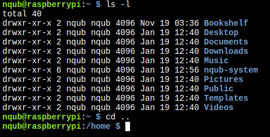
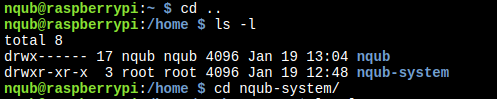

# NQUB System

Complete system installation for NQUB token dispenser system on Raspberry Pi 4, including backend, kiosk interface, and external display.

## Prerequisites

- Raspberry Pi 4 with fresh Raspberry Pi OS installation
- Two HDMI displays connected
- Internet connection
- GitHub account with access to NQUB repositories

## Hardware Setup

1. Connect primary display to HDMI-1
2. Connect secondary display to HDMI-2
3. Connect coin dispenser to USB port
4. Connect QR reader to USB port

## Installation

1. Open a terminal and go to the home directory:
   ```bash
   cd ..
   ```
   You will see something like this:
   

2. Clone this repository:
   ```bash
   git clone https://github.com/nqub/nqub-system.git
   cd nqub-system
   ```
   after cloning, you will see something like this:
   

3. Run the installation script:
   ```bash
   sudo chmod +x install.sh
   ./install.sh
   ```

4. During installation:
   - You'll be prompted to authenticate with GitHub
   - Accept any system configuration changes
   - Wait for all components to install and build

## System Components

### Backend (nqub-coin-dispenser)
- Handles hardware communication
- Manages coin dispensing
- Provides API endpoints

### Internal Interface (nqub-coin-disperser-internal-screen)
- Primary screen interface
- User interaction
- Transaction management
- Status display


### External Display (nqub-coin-dispenser-external-screen)
- Secondary screen interface
- Status display


## Updating repositories
To update the repositories, go back to the nqub-system directory inside the home directory and run the following command:
```bash
sudo chmod +x update.sh
./update.sh
```

